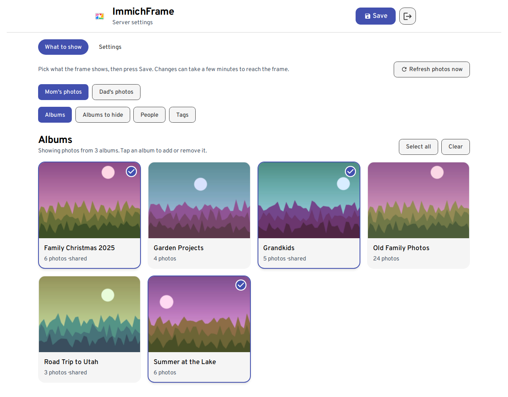
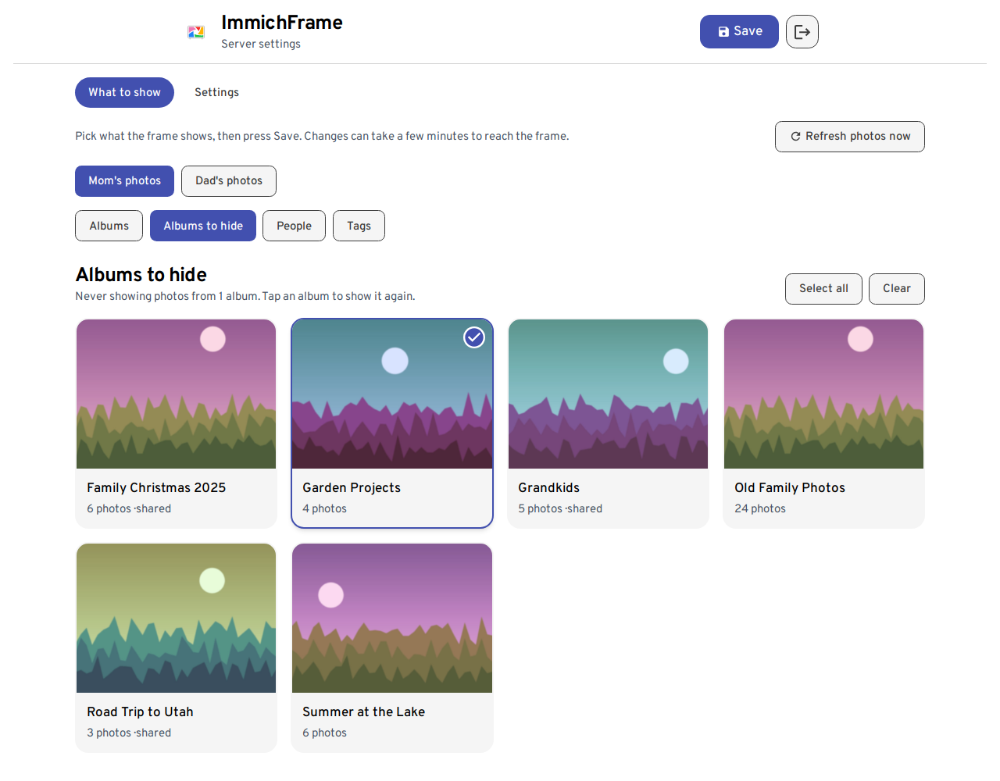
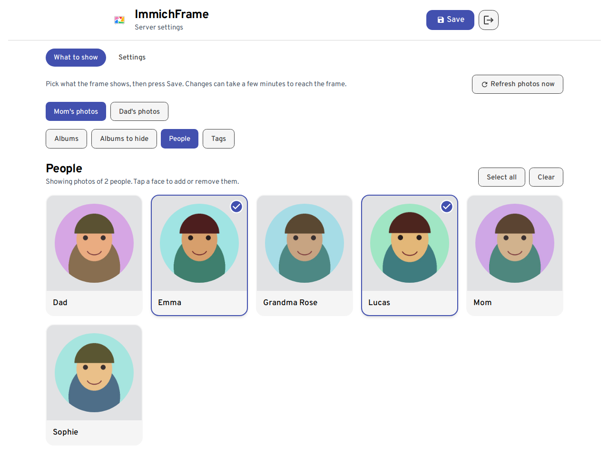
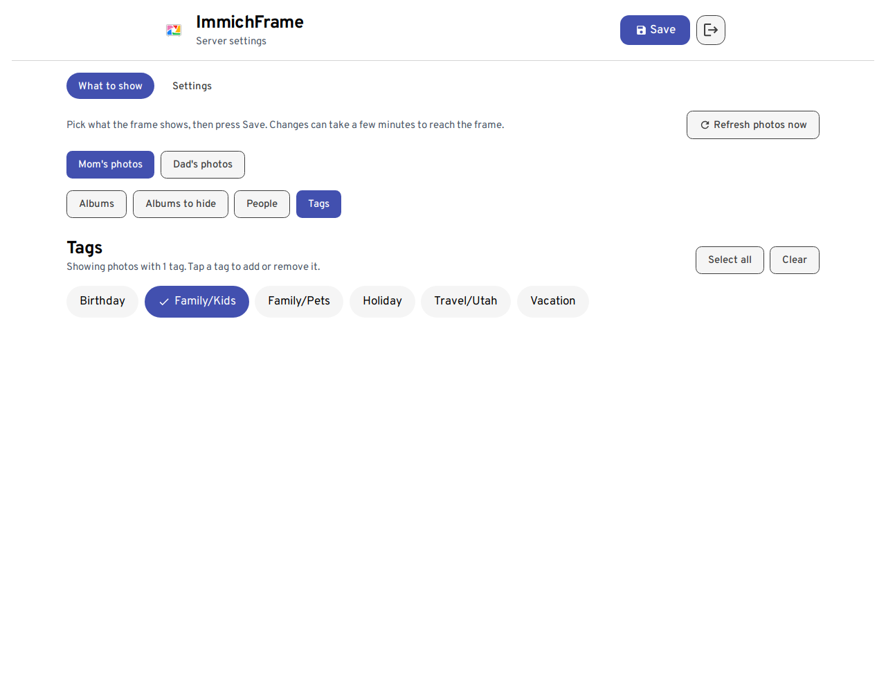
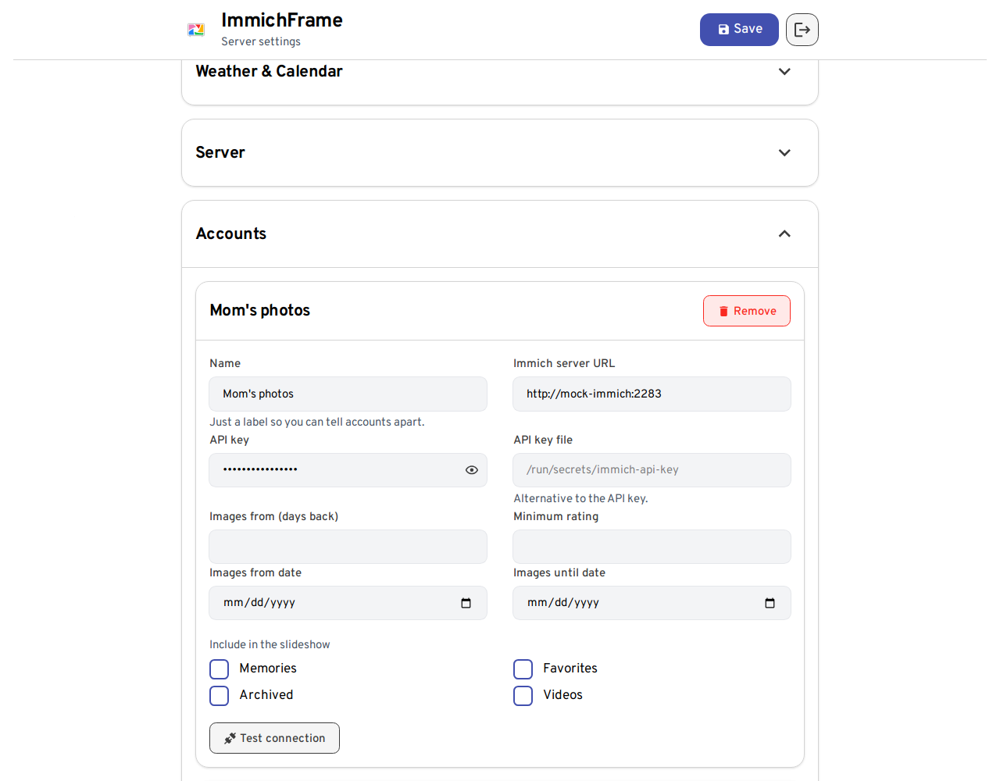
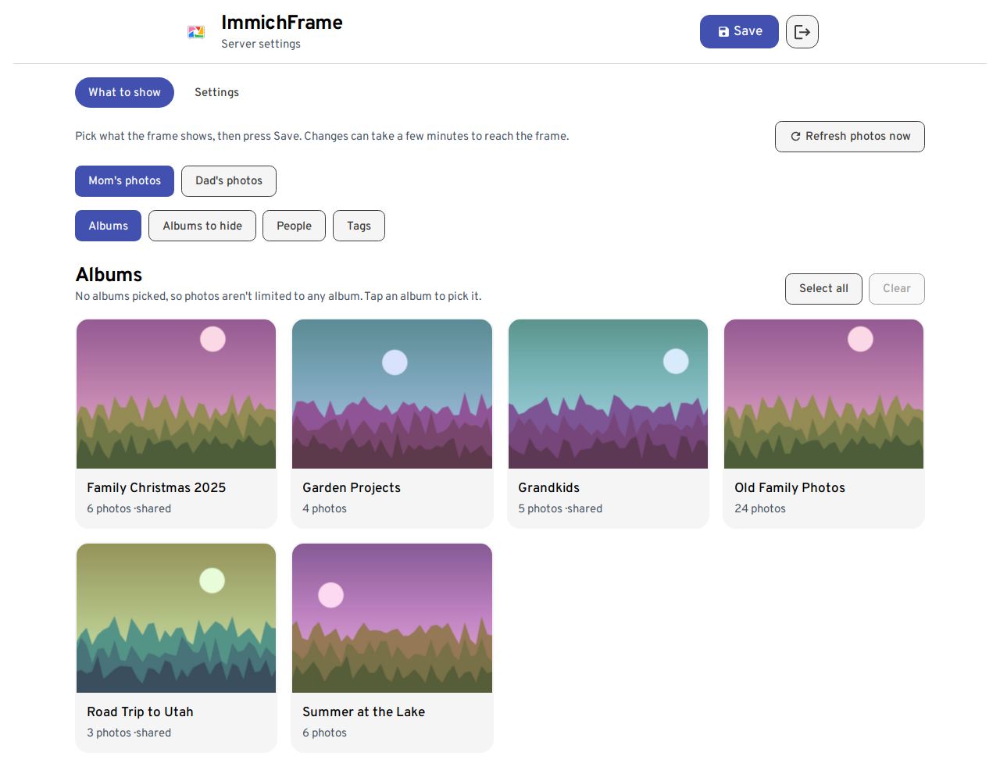
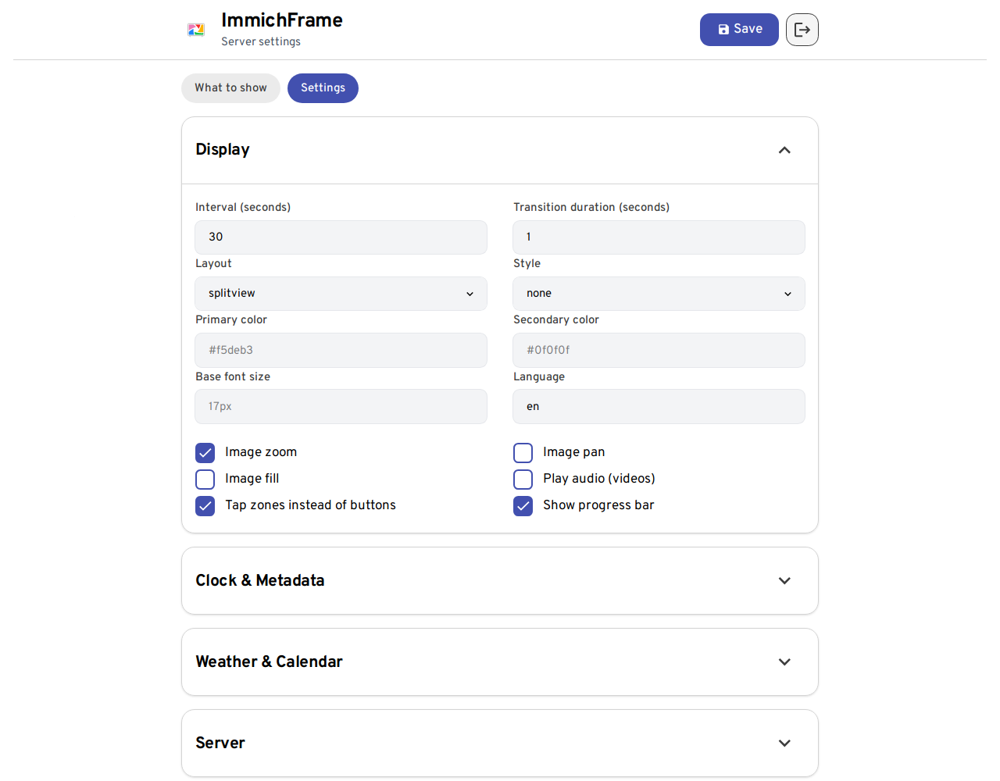
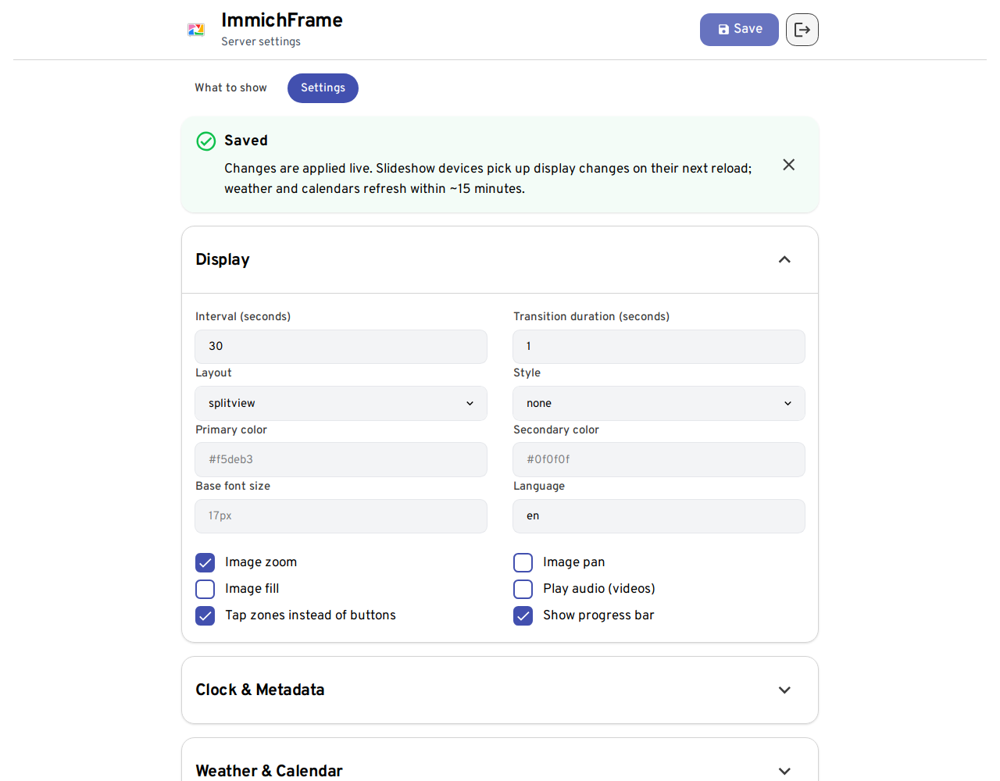
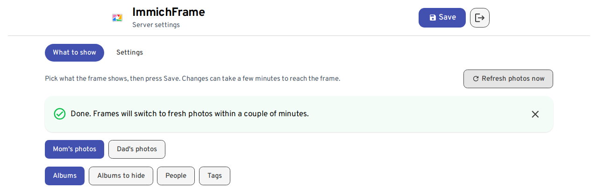
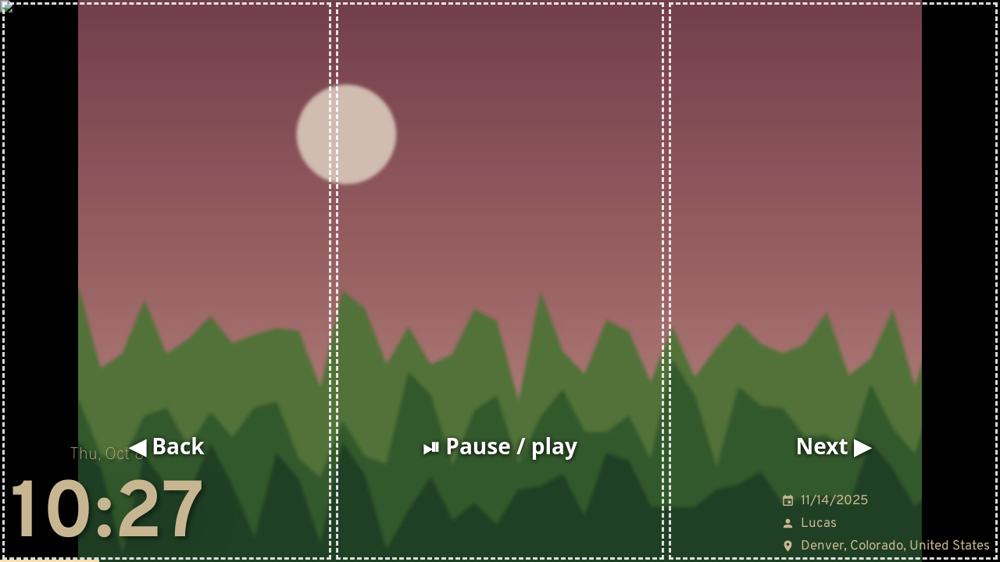

> 📌 This is a fork of ImmichFrame. For the original project, see the [upstream README](https://github.com/immichFrame/ImmichFrame#readme).

This fork exists to add features I wanted that the original project doesn't have.

<!-- FORK-FEATURES:START (generated by tools/screenshots/build-readme.mjs - do not edit by hand) -->
### What this fork adds

- **Pick albums, people and tags from tiles instead of typing UUIDs.** The admin UI has a "What to show" tab that lists albums, people and tags straight from Immich as tiles with cover photos. Tap what you want, press Save. The API key stays on the server.
- **Name your accounts.** Accounts get an optional name that is shown in the admin UI instead of "Account 1", "Account 2".
- **Admin split into "What to show" and "Settings" tabs.** Content selection and display settings are separate tabs. The selected tab is remembered across page refreshes, checkbox labels sit next to their boxes, and the "Saved" notice can be closed (and goes away by itself).
- **"Refresh photos now".** One button clears everything ImmichFrame cached from Immich and makes running frames drop their queued photos. Changing the picked albums/people/tags does the same automatically, and frames re-check their config every 2 minutes, so changes show up without reloading the frame.
- **Tap-zone controls for touch screens.** New `TouchZoneControls` setting. The slideshow is split into three invisible tap zones: left = back, middle = pause/play, right = next. Works with mouse clicks too. (The dashed outlines in the screenshot are drawn for illustration only.)

### Screenshots

#### Pick albums, people and tags from tiles instead of typing UUIDs

 Albums, with a few picked

 Albums to hide

 People

 Tags

#### Name your accounts

 Named accounts in Settings

 The account switcher on "What to show"

#### Admin split into "What to show" and "Settings" tabs

 The Settings tab

 The closable "Saved" notice

#### "Refresh photos now"

 Refresh photos now

#### Tap-zone controls for touch screens

 Left / middle / right tap zones

<!-- FORK-FEATURES:END -->

---

[![Contributors][contributors-shield]][contributors-url]
[![Forks][forks-shield]][forks-url]
[![Stargazers][stars-shield]][stars-url]
[![Issues][issues-shield]][issues-url]
[![MIT License][license-shield]][license-url]

<!-- PROJECT LOGO -->
 

  

  <h3 align="center">ImmichFrame</h3>

  

    An awesome way to display your photos as a digital photo frame
     
    <a href="https://immich.app/"><strong>Explore immich »</strong></a>
     
     
    <a href="https://immichframe.dev">Documentation</a>
    ·
    <a href="https://demo.immichframe.dev">Demo</a>
    ·
    <a href="https://github.com/3rob3/ImmichFrame/issues">Report Bug</a>
    ·
    <a href="https://github.com/3rob3/ImmichFrame/issues">Request Feature</a>
  

## 📄 Documentation
You can find the documentation [here](https://immichframe.dev).

## 🖼️ Demo

You can find a working demo [here](https://demo.immichframe.dev).

## ⚠️ Disclaimer

**This project is not affiliated with [immich][immich-github-url]!**

## 📜 License

[GNU General Public License v3.0](LICENSE.txt)

## 🆘 Help

[Discord Channel][support-url]

## 🙏 Acknowledgments

- BIG thanks to the [immich team][immich-github-url] for creating an awesome tool

## 🌟 Star History

<!-- MARKDOWN LINKS & IMAGES -->
<!-- https://www.markdownguide.org/basic-syntax/#reference-style-links -->

[contributors-shield]: https://img.shields.io/github/contributors/immichFrame/ImmichFrame.svg?style=for-the-badge
[contributors-url]: https://github.com/immichFrame/ImmichFrame/graphs/contributors
[forks-shield]: https://img.shields.io/github/forks/immichFrame/ImmichFrame.svg?style=for-the-badge
[forks-url]: https://github.com/immichFrame/ImmichFrame/network/members
[stars-shield]: https://img.shields.io/github/stars/immichFrame/ImmichFrame.svg?style=for-the-badge
[stars-url]: https://github.com/immichFrame/ImmichFrame/stargazers
[issues-shield]: https://img.shields.io/github/issues/immichFrame/ImmichFrame.svg?style=for-the-badge
[issues-url]: https://github.com/immichFrame/ImmichFrame/issues
[license-shield]: https://img.shields.io/github/license/immichFrame/ImmichFrame.svg?style=for-the-badge
[license-url]: https://github.com/immichFrame/ImmichFrame/blob/master/LICENSE.txt
[releases-url]: https://github.com/immichFrame/ImmichFrame/releases/latest
[support-url]: https://discord.com/channels/979116623879368755/1217843270244372480
[openweathermap-url]: https://openweathermap.org/
[immich-github-url]: https://github.com/immich-app/immich
[immich-api-url]: https://immich.app/docs/features/command-line-interface#obtain-the-api-key
